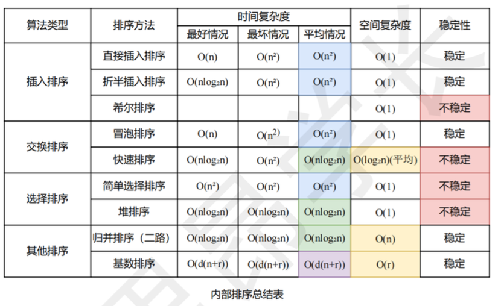

1.1数据结构的基本概念
1.2算法和算法评价

2.1线性表的定义和基本操作
2.2线性表的顺序表示
2.3线性表的链式表示

3.1栈
3.2队列
3.3栈和队列的应用
3.4数组和特殊矩阵

4串

5.1树的基本概念
5.2二叉树的基本概念
5.3二叉树的遍历和线索二叉树
5.4树、森林........
5.5树与二叉树的应用

### 树的存储结构
#### 双亲表示法
#### 孩子表示法
#### 孩子-兄弟表示法

### 树、森林与二叉树之间的转换

6.1图的基本概念
### 图的存储
#### 邻接矩阵

#### 邻接表
#### 十字链表
#### 邻接多重表

6.3图的遍历

6.4图的应用

## 查找
### 顺序查找

### 折半查找
#### 折半查找判定树
#### 分块查找

### 树形查找
#### 二叉搜索树
#### 二叉搜索树的查找
#### 二叉搜索树的插入

### B树和B+树
树形查找
B树和B+树
散列表(Hash表)

## 排序

### 插入排序
#### 直接插入排序
#### 折半插入排序
#### 希尔排序

### 交换排序
#### 冒泡排序
#### 快速排序

### 选择排序
#### 简单选择排序
#### 堆排序
### 归并排序、基数排序和计数排序

外部排序